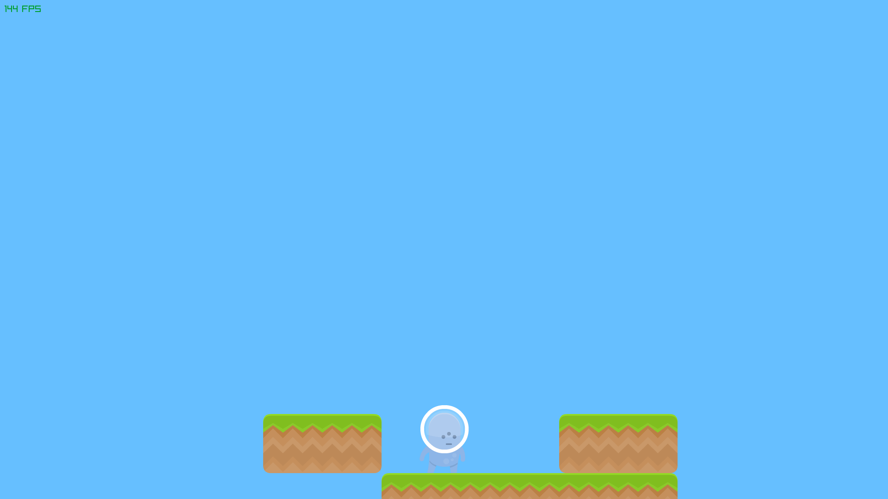

# Platformer

The goal with this project is to learn all the basics of a platformer type of game



# Compile and run

```
odin run . -out:bin/game
```

## References
- https://odin-lang.org/
- https://github.com/raysan5/raylib
- https://www.kenney.nl/
- https://www.youtube.com/watch?v=hG9SzQxaCm8
- https://gafferongames.com/post/integration_basics/